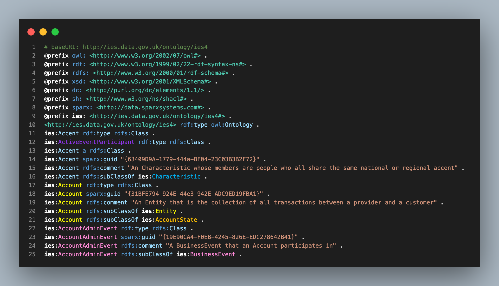
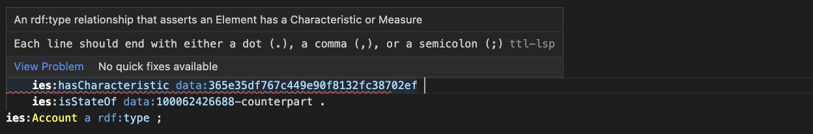
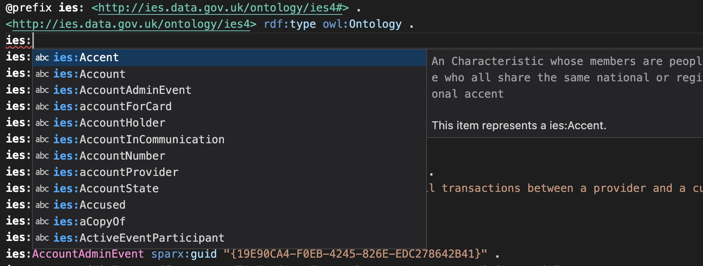
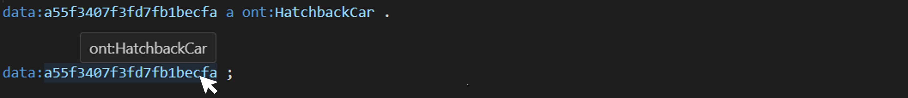

## IES Syntax Highlighter

A [Visual Studio Code](https://code.visualstudio.com) (VSCode) extension to help working with [IES](https://github.com/dstl/IES4) in [Terse RDF Triple Language (TTL)](https://www.w3.org/TR/turtle/) (.ttl) files

Features:
<ul>
  <li>
    <strong>Colour highlighting</strong> - Highlights IES classes according to their defined colours 
    
  </li>
  <li>
    <strong>Diagnostics</strong> - Syntax highlights missing commas, dots, semicolons 
    
  </li>
  <li>
    <strong>IES class suggestions</strong> - Suggests IES classes as you type 
    
  </li>
  <li>
    <strong>On hover matches</strong> - Hover over a URI to reveal IES type 
    
  </li>
</ul>

## Install

1. Download latest [releases](https://github.com/telicent-oss/ies-syntax-highlighter-vscode-extension/releases)

In VSCode:

2. Click "Extensions" icon in the **Activity Bar** on the side of VS Code or the **View: Extensions** command `Cmd/Ctrl + Shift + x`.

3. Click on the Extensions view command dropdown, the three dots (`...`), located at the top of the Extensions view and select **Install from VSIX...**

4. Navigate to the downloaded release file (step 1) and select it.

5. Select theme IES Highlighter1 dark+ default `Cmd/Ctrl + k` then `Cmd/Ctrl + t`. Or go to the Extensions view -> ies-extension -> Set Colour Theme.

1 **Note:** Syntax highlighting has not been optimized for "light" themes, e.g. highlights `ies:` prefix as _white_
 
The extension should now be activated when you open .ttl files.

Additional, optional, steps **if you don't want to change themes** and still have colour highlighting:

6. **Go to VS Code settings** - open the Settings editor by navigating to `Code > Settings > Settings` or using the shortcut `Cmd/Ctrl + ,`

7. **Search settings** - In the Settings Search bar, type `editor.tokenColorCustomizations` and select `Edit in settings.json`

8. **Append contents** - Use `Ctrl/Cmd + C` and then `Ctrl/Cmd + V` to copy and paste the contents of the file [main/for_settings.txt](https://raw.githubusercontent.com/telicent-oss/ies-syntax-highlighter-vscode-extension/main/for_settings.txt) to the JSON in settings.

Further information on managing extensions in VS Code can be found on the [Microsoft VS Code Extension Marketplace](https://code.visualstudio.com/docs/editor/extension-marketplace) page.

## Usage

1. **Install** extension, as [above](#Install)

2. **Select theme** within the IES Syntax Highlighter extension page in VS Code, as required

3. **Create** or **open** a file ending with extension .ttl

4. **Enter IES TTL data** and the features of the IES Syntax Highlighter will highlight classes, diagnose syntax errors, autocomplete classes and track what type instances are.
